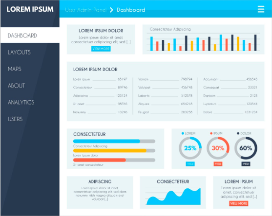

# AcademiaPro · SaaS de Gestión de Academia

Aplicación web SaaS para la administración integral de una academia, construida con **Laravel 11** y **MySQL**. Incluye autenticación, dashboard con gráficos y los módulos de Estudiantes, Matrículas, Cursos, Docentes, Pagos, Asistencia y Calificaciones.



---

## Requisitos

- PHP >= 8.2 (extensiones: `pdo_mysql`, `mbstring`, `openssl`, `tokenizer`, `xml`, `ctype`, `json`, `bcmath`)
- Composer 2
- MySQL 5.7+ / MariaDB 10.4+

---

## Instalación paso a paso

Desde la carpeta del proyecto:

```bash
# 1) Instalar dependencias de Laravel (crea la carpeta vendor/)
composer install

# 2) Generar la clave de la aplicación
php artisan key:generate
```

El archivo `.env` ya viene configurado para tu servidor local:

```
DB_CONNECTION=mysql
DB_HOST=127.0.0.1
DB_PORT=3306
DB_DATABASE=saas_academia
DB_USERNAME=root
DB_PASSWORD=
```

> Si tu usuario `root` tiene contraseña, edítala en `DB_PASSWORD` dentro de `.env`.

```bash
# 3) Crear la base de datos (una sola vez)
mysql -u root -p < database/crear_base_datos.sql
#    ...o créala manualmente en phpMyAdmin con el nombre: saas_academia

# 4) Crear las tablas y cargar datos de demostración
php artisan migrate --seed

# 5) Levantar el servidor
php artisan serve
```

Abre **http://localhost:8000** en el navegador.

---

## Acceso de prueba (contraseña: `password`)

| Rol                       | Correo                    | Acceso |
|---------------------------|---------------------------|--------|
| **Super Admin** (plataforma) | `superadmin@saas.com`  | Panel global: academias, planes, suscripciones, bitácora |
| Administrador (academia 1)| `admin@academia.com`      | Academia "Central de Idiomas y Sistemas" |
| Secretaría                | `secretaria@academia.com` | Academia 1 (acceso limitado) |
| Admin academia 2          | `admin2@academia.com`     | Academia "Instituto Técnico Horizonte" |
| Admin academia 3          | `admin3@academia.com`     | Academia "Centro de Formación Aurora" |
| **Docente** (academia 1)  | `docente@academia.com`    | Panel del docente: sus cursos, asistencia y notas |
| **Estudiante** (academia 1) | `estudiante@academia.com` | Portal del alumno: cursos, pagos, notas, asistencia |

> El **Super Admin** ve todas las academias y puede "Entrar" a cualquiera para administrarla; cada academia sólo ve sus propios datos (multi-tenant).

### Portales y autoservicio

- **Portal del estudiante** (`/portal`): el alumno ve sus cursos, calificaciones, asistencia y paga sus cuotas en línea.
- **Panel del docente** (`/docente`): el profesor ve sus cursos asignados, registra asistencia y califica — solo de sus cursos.
- **Pagos en línea** (checkout simulado): los estudiantes pagan cuotas y las academias pagan su suscripción con un formulario de tarjeta de demostración.
- **Reportes en PDF**: botón "Imprimir / PDF" en Reportes (genera una hoja imprimible vía navegador) y nuevos gráficos (cobranza, promedio por curso).

---

## Módulos incluidos

| Módulo            | Funcionalidad |
|-------------------|---------------|
| **Dashboard**     | Indicadores clave, gráfico de ingresos/matrículas, anillos de rendimiento, top de cursos y últimas matrículas. |
| **Estudiantes**   | Alta/edición/baja, búsqueda, ficha con cursos matriculados, datos de apoderado. |
| **Matrículas**    | Inscripción de estudiante en curso; **genera el cobro de matrícula automáticamente**. |
| **Cursos**        | Catálogo con nivel, modalidad, horario, cupos, costos y docente asignado. |
| **Docentes**      | Plantel de profesores con especialidad y cursos a cargo. |
| **Pagos**         | Cobros y cuotas, métodos de pago, estados (pagado/pendiente/anulado), totales y botón "marcar pagado". |
| **Asistencia**    | Hoja de asistencia diaria por curso (presente, ausente, tardanza, justificado). |
| **Calificaciones**| Registro de evaluaciones y notas por estudiante y curso. |
| **Recibos**       | Comprobante de pago imprimible / guardable como PDF desde el navegador, con datos de la academia. |
| **Reportes**      | Ingresos por mes, morosidad, asistencia por curso y rendimiento académico, con exportación a CSV (Excel). |
| **Usuarios y roles** | Gestión de accesos con roles. Pantalla **Roles y permisos** para definir a qué módulos accede cada rol. |
| **Configuración** | Datos de la academia (nombre, logo, NIT, moneda, periodo) que se reflejan en el sistema y los recibos. |
| **Mi perfil** | Cada usuario edita su nombre, correo, foto y contraseña. |
| **Bitácora** | Registro de auditoría: quién creó/editó/eliminó qué y cuándo, con filtros. |

### Panel Super Admin (multi-tenant)

| Sección | Funcionalidad |
|---------|---------------|
| **Panel general** | Métricas globales: total de academias, estudiantes, usuarios e ingresos recurrentes (MRR), con gráficos. |
| **Academias** | CRUD de academias (tenants), creación con su administrador, y botón **Entrar** para administrar cualquiera. |
| **Planes** | Gestión de planes de suscripción (precio, límites de estudiantes/usuarios/cursos, características). |
| **Suscripciones** | Estado y plan de cada academia (activa, prueba, vencida, cancelada). |
| **Facturación** | Facturas de suscripción por academia: generación mensual, marcar pagada y recibo imprimible. |
| **Bitácora global** | Auditoría de toda la plataforma. |

### Funciones SaaS

| Función | Detalle |
|---------|---------|
| **Landing pública** | Página de inicio en `/` con presentación, features y precios (tomados de los planes). |
| **Registro self-service** | En `/registrar` una academia crea su cuenta, elige plan y arranca con **15 días de prueba**; queda autenticada al instante. |
| **Límites de plan** | Al crear estudiantes/usuarios/cursos se valida el cupo del plan; el dashboard muestra el uso (barras). |
| **Mi plan** | Cada academia ve su plan, estado de suscripción y sus facturas. |
| **Correos** | Bienvenida al registrarse, aviso de vencimiento de suscripción y recordatorio de pagos pendientes. |

**Correos y tareas programadas:** por defecto `MAIL_MAILER=log`, así que los correos se escriben en `storage/logs/laravel.log` (no se envían de verdad hasta configurar SMTP). Avisos:

```bash
php artisan academia:avisos                       # envía vencimientos + pagos pendientes
php artisan academia:avisos --solo=vencimientos   # sólo suscripciones por vencer
php artisan schedule:work                         # ejecuta el planificador (vencimientos diario, pagos semanal)
```

> **Multi-tenant:** cada academia tiene sus datos aislados mediante `academia_id` y un *global scope* automático. El Super Admin opera sobre todas.

> **Diseño responsivo:** el sistema se adapta a escritorio, tablet y móvil. En pantallas pequeñas el menú lateral se colapsa y se abre con el botón ☰.

---

## Estructura del proyecto

```
app/
  Http/Controllers/   → Controladores (Auth, Dashboard, 7 módulos)
  Models/             → Modelos Eloquent con relaciones
database/
  migrations/         → Esquema de la base de datos
  seeders/            → Datos de demostración (DatabaseSeeder)
  crear_base_datos.sql→ Script para crear la BD saas_academia
resources/views/      → Vistas Blade (layout + login + módulos)
public/css/app.css    → Diseño visual (sidebar oscuro + header cian)
routes/web.php        → Rutas de la aplicación
```

---

## Actualización a la versión multi-tenant (Super Admin)

Esta versión introduce multi-tenancy (columna `academia_id`, nuevo rol Super Admin, planes y suscripciones). Debes recrear la base de datos de demostración:

```bash
php artisan migrate:fresh --seed   # recrea las tablas y carga 3 academias demo
php artisan storage:link           # habilita logos y avatares
php artisan optimize:clear         # limpia cachés de rutas/vistas/config
```

> ⚠️ `migrate:fresh` borra los datos actuales (son de demostración). Inicia sesión como **superadmin@saas.com** para ver el panel de la plataforma.

## Comandos útiles

```bash
php artisan migrate:fresh --seed   # Reinicia la BD y recarga datos demo
php artisan optimize:clear         # Limpia cachés de config/rutas/vistas
php artisan route:list             # Lista todas las rutas
```

---

## Diseño

La interfaz reproduce y mejora el mockup propuesto: barra lateral oscura con módulos agrupados, cabecera cian con breadcrumb y menú de usuario, tarjetas de estadísticas, gráficos (Chart.js), barras de progreso y anillos de porcentaje. La paleta y los componentes están centralizados en `public/css/app.css` para facilitar la personalización (variables CSS al inicio del archivo).

---

© 2026 AcademiaPro · Desarrollado con Laravel.
